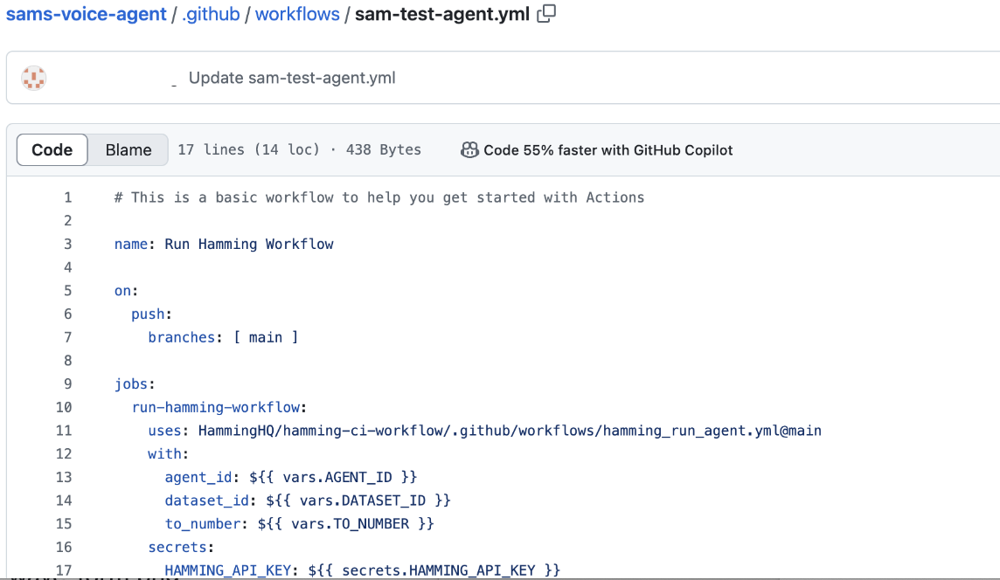
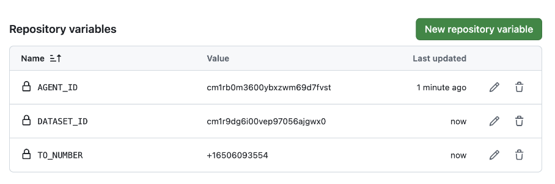
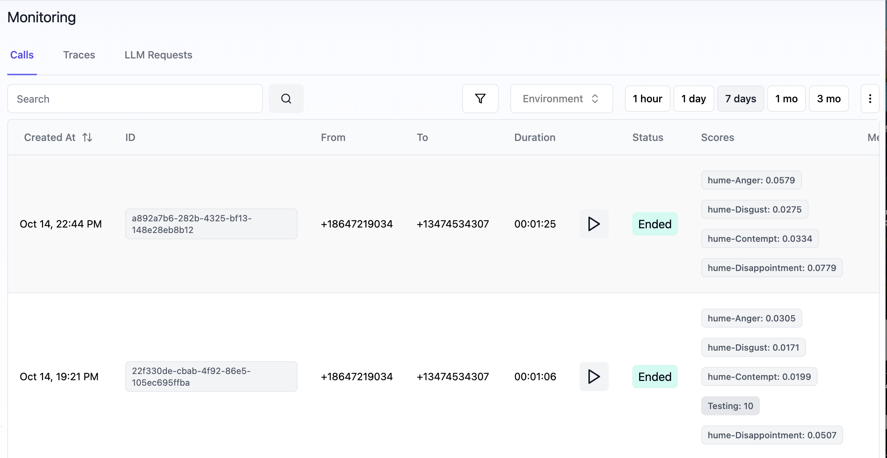

### Voice Agents Test Workflow Integration

With GitHub Actions, you can now automatically run your Hamming test agents whenever changes are made to your GitHub repository's main branch. 
You can easily set up actions for as many agents as you need by following a few simple steps.

## Step-by-Step Tutorial

<Note> 

You'll need to configure a Hamming Test Agent before setting up a workflow. For a detailed walkthrough on how to set up a Hamming Test Agent follow [this tutorial] (https://docs.hamming.ai/guides/voice-agent). 

</Note>

<Steps>

 <Step title="Configure Workflow on Github">

Navigate to your Github Repo containing the code of you voice agent. 
Then click on **Actions** at the top bar and select **Simple workflow** from the templates.
Paste the following code into the code area.


```yml
# This is a basic workflow to help you get started with Actions

name: Run Sam's Test Agent Workflow     #you can rename the workfow

on:
  push:
    branches: [ main ]

jobs:
  run-hamming-workflow:
    uses: HammingHQ/hamming-ci-workflow/.github/workflows/hamming_run_agent.yml@main
    with:
      agent_id: ${{ vars.AGENT_ID }}
      dataset_id: ${{ vars.DATASET_ID }}
      to_number: ${{ vars.TO_NUMBER }}
    secrets:
      HAMMING_API_KEY: ${{ secrets.HAMMING_API_KEY }}
```

Your workflow should look like this and should be a .yml file.

 

  </Step>

<Step title="Configure your Variables & Secrets">

Navigate to **Settings** to set up your repository variables (agent_id, dataset_id, to_number) and repository secrets (hamming api key). 
Select **Security** from the left navigation bar and then select **Secrets and variables**.

To find your agent_id check out this tutorial.
To find your dataset_id check out this tutorial. 
The TO_NUMBER should be the number you are AI Voice Agents number. 

Your final Variables Setup should look like this: 

<div style={{ display: "flex", justifyContent: "space-between" }}>


</div>


<Accordion icon="terminal" title="Finding Secrets and Variables on Github">
<div style={{ display: "flex", justifyContent: "space-between" }}>


</div>
</Accordion>


  </Step>

<Step title="Create a Node.js server that handles the webhook request">

This is the content of the index.ts file:

```typescript
import dotenv from "dotenv";
import { envsafe, str } from "envsafe";
import express from "express";
import { CallProvider, Hamming } from "@hamming/hamming-sdk";


dotenv.config();


const app = express();
app.use(express.json());


export const env = envsafe({
 HAMMING_API_KEY: str(),
});


const hamming = new Hamming({
 apiKey: env.HAMMING_API_KEY,
});


hamming.monitoring.start();


app.post("/retell-webhook", (req, res) => {
 hamming.monitoring.callEvent(CallProvider.Retell, req.body);
 res.sendStatus(200);
});


app.listen(3010, () => {
 console.log("Server is running on port 3010");
});
```

  </Step>


<Step title="Set up your .env file" >


Set up a Hamming API Key by going to [hamming.ai/settings](https://app.hamming.ai/settings) and selecting Create a new secret key at the top. Then, add the API key to your .env file as shown in the code snippet below.

```
HAMMING_API_KEY=your_hamming_api_key
```

Next run the following command.

```bash
npm run dev
```

  </Step>

<Step title="Monitor Calls" >


Once both ngrok and your application are running, monitoring will log all inbound and outbound phone calls and generate Hume scores, providing valuable insights into the performance and sentiment of the calls.


<div style={{ display: "flex", justifyContent: "space-between" }}>
 

</div>


  </Step>

</Steps>

## VAPI Tutorial

<Note> 

Ensure that you have installed and authorized ngrok before continuing. To learn more visit https://ngrok.com.

</Note>

<Steps>


 <Step title="Start ngrok" >

  ```bash
ngrok http 3010
```
 
  </Step>

<Step title="Set up VAPI AI Webhook">

After completing step 2, a window will display a **Forwarding Link**. Copy the link and append **/vapi-webhook** to the end. Your final link should look similar to this:

```
https://8c21-2600-1700-2800-2b10-5d7c-6b08-73ad-e541.ngrok-free.app/vapi-webhook
```


<Accordion icon="terminal" title="Finding Your Forwarding Link">

</Accordion>


Go to https://dashboard.vapi.ai/assistants and select your agent. Look for the **Advanced** in the dropdown, and paste the link you created into the **Server URL** field.


  </Step>

<Step title="Create a Node.js server that handles the webhook request">

This is the content of the index.ts file:

```typescript
import dotenv from "dotenv";
import { envsafe, str } from "envsafe";
import express from "express";
import { CallProvider, Hamming } from "@hamming/hamming-sdk";


dotenv.config();


const app = express();
app.use(express.json());


export const env = envsafe({
 HAMMING_API_KEY: str(),
});


const hamming = new Hamming({
 apiKey: env.HAMMING_API_KEY,
});


hamming.monitoring.start();


app.post("/vapi-webhook", (req, res) => {
 hamming.monitoring.callEvent(CallProvider.Vapi, req.body);
 res.sendStatus(200);
});


app.listen(3010, () => {
 console.log("Server is running on port 3010");
});
```

  </Step>


<Step title="Set up your .env file" >


Set up a Hamming API Key by going to [hamming.ai/settings](https://app.hamming.ai/settings) and selecting Create a new secret key at the top. Then, add the API key to your .env file as shown in the code snippet below.

```
HAMMING_API_KEY=your_hamming_api_key
```

Next run the following command.

```bash
npm run dev
```

  </Step>

<Step title="Monitor Calls" >


Once both ngrok and your application are running, monitoring will log all inbound and outbound phone calls and generate Hume scores, providing valuable insights into the performance and sentiment of the calls.

<div style={{ display: "flex", justifyContent: "space-between" }}>
 

</div>


  </Step>

</Steps>

