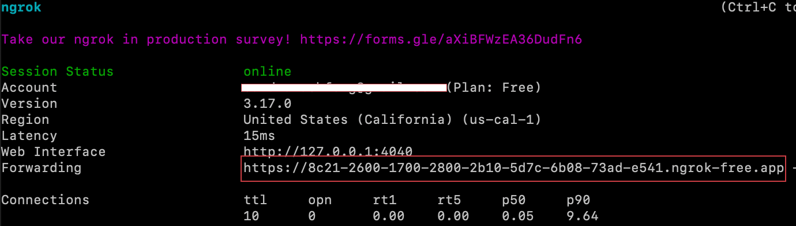
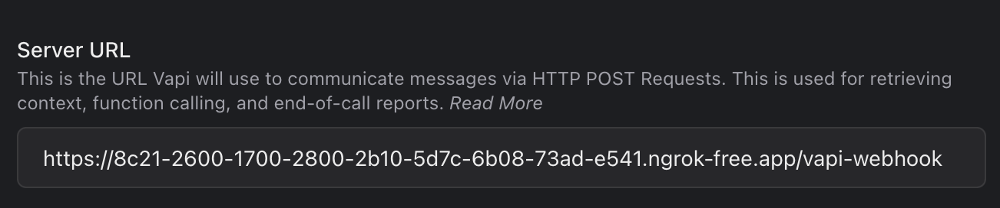

### Set up Voice Monitoring

Voice Call Monitoring allows you to evaluate the reliability of your AI voice agent(s). With a few easy steps, you can set up monitoring on Hamming to track your agent's performance. It also provides Hume scoring, offering key insights into caller sentiment.


<CardGroup cols={2}>
  <Card 
  title="Retell Agent Monitoring" 
  icon = {<svg width="50" height="50" viewBox="0 0 768 768" fill="none" xmlns="http://www.w3.org/2000/svg">
<rect width="50" height="50" fill="none"/>
<path fill-rule="evenodd" clip-rule="evenodd" d="M319.132 221.838C340.626 221.838 358.051 204.413 358.051 182.919C358.051 161.425 340.626 144 319.132 144C297.637 144 280.213 161.425 280.213 182.919C280.213 204.413 297.637 221.838 319.132 221.838ZM478.632 384C503.175 372.719 520.216 347.917 520.216 319.136C520.216 279.729 488.271 247.784 448.865 247.784C420.085 247.784 395.284 264.824 384.002 289.366C372.72 264.824 347.919 247.784 319.138 247.784C279.732 247.784 247.787 279.729 247.787 319.136C247.787 347.917 264.829 372.719 289.372 384C264.829 395.282 247.787 420.083 247.787 448.865C247.787 488.271 279.732 520.216 319.138 520.216C347.919 520.216 372.72 503.176 384.002 478.635C395.284 503.176 420.085 520.216 448.865 520.216C488.271 520.216 520.216 488.271 520.216 448.865C520.216 420.083 503.175 395.282 478.632 384ZM384.002 419.095C391.119 403.613 403.616 391.117 419.098 384C403.616 376.884 391.119 364.387 384.002 348.905C376.884 364.387 364.387 376.884 348.905 384C364.387 391.117 376.884 403.613 384.002 419.095ZM474.81 182.919C474.81 197.248 463.193 208.865 448.864 208.865C434.534 208.865 422.918 197.248 422.918 182.919C422.918 168.589 434.534 156.973 448.864 156.973C463.193 156.973 474.81 168.589 474.81 182.919ZM182.919 345.08C197.248 345.08 208.865 333.464 208.865 319.134C208.865 304.805 197.248 293.188 182.919 293.188C168.589 293.188 156.973 304.805 156.973 319.134C156.973 333.464 168.589 345.08 182.919 345.08ZM345.083 585.08C345.083 599.409 333.467 611.026 319.137 611.026C304.808 611.026 293.191 599.409 293.191 585.08C293.191 570.75 304.808 559.134 319.137 559.134C333.467 559.134 345.083 570.75 345.083 585.08ZM585.083 474.81C599.412 474.81 611.029 463.193 611.029 448.864C611.029 434.534 599.412 422.918 585.083 422.918C570.753 422.918 559.137 434.534 559.137 448.864C559.137 463.193 570.753 474.81 585.083 474.81ZM202.384 182.918C202.384 193.666 193.671 202.378 182.924 202.378C172.177 202.378 163.465 193.666 163.465 182.918C163.465 172.171 172.177 163.459 182.924 163.459C193.671 163.459 202.384 172.171 202.384 182.918ZM182.924 604.542C193.671 604.542 202.384 595.83 202.384 585.083C202.384 574.335 193.671 565.623 182.924 565.623C172.177 565.623 163.465 574.335 163.465 585.083C163.465 595.83 172.177 604.542 182.924 604.542ZM604.542 585.083C604.542 595.83 595.83 604.542 585.083 604.542C574.335 604.542 565.623 595.83 565.623 585.083C565.623 574.335 574.335 565.623 585.083 565.623C595.83 565.623 604.542 574.335 604.542 585.083ZM585.083 202.378C595.83 202.378 604.542 193.666 604.542 182.918C604.542 172.171 595.83 163.459 585.083 163.459C574.335 163.459 565.623 172.171 565.623 182.918C565.623 193.666 574.335 202.378 585.083 202.378ZM487.783 585.08C487.783 606.574 470.359 623.999 448.864 623.999C427.37 623.999 409.945 606.574 409.945 585.08C409.945 563.586 427.37 546.161 448.864 546.161C470.359 546.161 487.783 563.586 487.783 585.08ZM585.083 358.054C606.577 358.054 624.002 340.629 624.002 319.135C624.002 297.64 606.577 280.216 585.083 280.216C563.589 280.216 546.164 297.64 546.164 319.135C546.164 340.629 563.589 358.054 585.083 358.054ZM221.838 448.867C221.838 470.361 204.413 487.786 182.919 487.786C161.425 487.786 144 470.361 144 448.867C144 427.373 161.425 409.948 182.919 409.948C204.413 409.948 221.838 427.373 221.838 448.867Z" fill="white"/>
</svg>}
  href="#retell-tutorial"
>
If you use Retell to run voice agents, follow this tutorial.
  </Card>

  <Card 
  title="VAPI Agent Monitoring" 
  icon={<?xml version="1.0" standalone="no"?>
<!DOCTYPE svg PUBLIC "-//W3C//DTD SVG 20010904//EN"
 "http://www.w3.org/TR/2001/REC-SVG-20010904/DTD/svg10.dtd">
<svg version="1.0" xmlns="http://www.w3.org/2000/svg"
 width="100" height="100" viewBox="0 0 1700.000000 2700.000000"
 preserveAspectRatio="xMidYMid meet">
<g transform="translate(0.000000,1284.000000) scale(0.100000,-0.100000)"
fill="#ffffff" stroke="none">
<path d="M2875 6140 c467 -39 962 -245 1277 -531 116 -104 318 -326 370 -405
117 -176 356 -643 677 -1319 216 -453 290 -607 651 -1342 248 -504 311 -597
453 -668 104 -52 171 -26 312 120 97 101 108 120 454 825 352 715 856 1718
944 1880 142 260 158 284 321 480 224 269 479 481 731 609 255 128 475 189
812 226 178 19 275 19 483 0 273 -25 398 -44 545 -81 224 -57 374 -125 550
-250 157 -112 202 -149 364 -302 272 -258 362 -374 501 -647 132 -258 168
-377 189 -622 14 -152 14 -391 1 -503 -16 -135 -84 -406 -140 -557 -82 -218
38 29 -1800 -3688 -2035 -4116 -2219 -4484 -2276 -4575 -174 -273 -428 -531
-713 -724 -109 -74 -354 -197 -460 -230 -211 -67 -553 -129 -706 -128 -130 0
-493 46 -619 78 -196 49 -514 192 -669 300 -253 177 -473 401 -637 650 -93
141 -391 740 -1387 2794 -140 289 -403 824 -583 1190 -180 366 -357 726 -393
800 -91 191 -944 1942 -1224 2515 -427 870 -505 1042 -558 1227 -56 192 -70
308 -70 593 0 249 10 368 40 476 9 30 25 90 36 134 12 44 39 121 60 172 21 51
39 99 39 106 0 8 15 38 34 65 18 28 36 62 40 76 17 68 238 355 383 497 194
190 303 271 525 391 266 143 506 241 748 305 288 76 409 87 695 63z"/>
</g>
</svg>}
  href = "#vapi-tutorial"
>
If you use VAPI to run voice agents, follow this tutorial.
</Card>


</CardGroup>


## Retell Tutorial

<Note> 

Ensure that you have installed and authorized ngrok before continuing. To learn more visit https://ngrok.com.

</Note>

<Steps>


 <Step title="Start ngrok" >

  ```bash
ngrok http 3010
```
 
  </Step>

<Step title="Set up Retell AI Webhook">

After completing Step 1, a window will display a **Forwarding Link**. Copy the link and append **/retell-webhook** to the end. Your final link should look similar to this:

```
https://688ee840-00505-39395.ngrok-free.app/retell-webhook
```


<Accordion icon="terminal" title="Finding Your Forwarding Link">

</Accordion>


Go to https://dashboard.retellai.com/agents and select your agent. Look for the **Webhook Settings** tab, and paste the link you created into the **Agent Level Webhook URL** field.


  </Step>

<Step title="Create a Node.js server that handles the webhook request">

This is the content of the index.ts file:

```typescript
import dotenv from "dotenv";
import { envsafe, str } from "envsafe";
import express from "express";
import { CallProvider, Hamming } from "@hamming/hamming-sdk";


dotenv.config();


const app = express();
app.use(express.json());


export const env = envsafe({
 HAMMING_API_KEY: str(),
});


const hamming = new Hamming({
 apiKey: env.HAMMING_API_KEY,
});


hamming.monitoring.start();


app.post("/retell-webhook", (req, res) => {
 hamming.monitoring.callEvent(CallProvider.Retell, req.body);
 res.sendStatus(200);
});


app.listen(3010, () => {
 console.log("Server is running on port 3010");
});
```

  </Step>


<Step title="Set up your .env file" >


Set up a Hamming API Key by going to [hamming.ai/settings](https://app.hamming.ai/settings) and selecting Create a new secret key at the top. Then, add the API key to your .env file as shown in the code snippet below.

```
HAMMING_API_KEY=your_hamming_api_key
```

Next run the following command.

```bash
npm run dev
```

  </Step>

<Step title="Track Monitoring Page" >


Once both ngrok and your application are running, monitoring will log all inbound and outbound phone calls and generate Hume scores, providing valuable insights into the performance and sentiment of the calls.

<Accordion icon="phone" title="Monitoring Page">

</Accordion>

  </Step>

</Steps>

## VAPI Tutorial

<Note> 

Ensure that you have installed and authorized ngrok before continuing. To learn more visit https://ngrok.com.

</Note>

<Steps>


 <Step title="Start ngrok" >

  ```bash
ngrok http 3010
```
 
  </Step>

<Step title="Set up VAPI AI Webhook">

After completing step 2, a window will display a **Forwarding Link**. Copy the link and append **/vapi-webhook** to the end. Your final link should look similar to this:

```
https://688ee840-00505-39395.ngrok-free.app/vapi-webhook
```


<Accordion icon="terminal" title="Finding Your Forwarding Link">

</Accordion>


Go to https://dashboard.vapi.ai/assistants and select your agent. Look for the **Advanced** in the dropdown, and paste the link you created into the **Server URL** field.



  </Step>

<Step title="Create a Node.js server that handles the webhook request">

This is the content of the index.ts file:

```typescript
import dotenv from "dotenv";
import { envsafe, str } from "envsafe";
import express from "express";
import { CallProvider, Hamming } from "@hamming/hamming-sdk";


dotenv.config();


const app = express();
app.use(express.json());


export const env = envsafe({
 HAMMING_API_KEY: str(),
});


const hamming = new Hamming({
 apiKey: env.HAMMING_API_KEY,
});


hamming.monitoring.start();


app.post("/vapi-webhook", (req, res) => {
 hamming.monitoring.callEvent(CallProvider.Vapi, req.body);
 res.sendStatus(200);
});


app.listen(3010, () => {
 console.log("Server is running on port 3010");
});
```

  </Step>


<Step title="Set up your .env file" >


Set up a Hamming API Key by going to [hamming.ai/settings](https://app.hamming.ai/settings) and selecting Create a new secret key at the top. Then, add the API key to your .env file as shown in the code snippet below.

```
HAMMING_API_KEY=your_hamming_api_key
```

Next run the following command.

```bash
npm run dev
```

  </Step>

<Step title="Track Monitoring Page" >


Once both ngrok and your application are running, monitoring will log all inbound and outbound phone calls and generate Hume scores, providing valuable insights into the performance and sentiment of the calls.

<Accordion icon="phone" title="Monitoring Page">

</Accordion>

  </Step>

</Steps>

