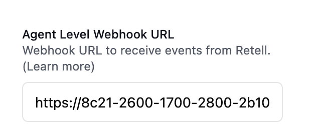

### Set up Voice Monitoring

Voice Call Monitoring allows you to evaluate the reliability of your AI voice agent(s). With a few easy steps, you can set up monitoring on Hamming to track your agent's performance. It also provides Hume scoring, offering key insights into caller sentiment.


<CardGroup cols={2}>
  <Card 
  title="Retell Agent Monitoring" 
  icon="phone"
  href="#retell-tutorial"
>
If you use Retell to run voice agents, follow this tutorial.
  </Card>

  <Card 
  title="VAPI Agent Monitoring" 
  icon="phone"
  href = "#vapi-tutorial"
>
If you use VAPI to run voice agents, follow this tutorial.
</Card>


</CardGroup>


## Retell Tutorial


<Steps>


<Warning> 

Ensure that you have installed and authorized ngrok before continuing. To learn more visit https://ngrok.com/download.

</Warning>

 <Step title="Initiate ngrok" >


Run the following command to fire up ngrok.

  ```
ngrok http 3010

```
 
  </Step>

<Step title="Set up Retell AI Webhook">

After completing step 2, a window will display a **Forwarding Link**. Copy the link and append **/retell-webhook** to the end. Your final link should look similar to this:

```
https://688ee840-00505-39395.ngrok-free.app/retell-webhook

```


<Accordion icon="terminal" title="Finding Your Forwarding Link">

</Accordion>


Go to https://dashboard.retellai.com/agents and select your agent. Look for the **Webhook Settings** tab, and paste the link you created into the **Agent Level Webhook URL** field.




  </Step>

<Step title="Create typescript project to run file with tsx">

Next, create an index.ts file inside your project folder.

```
import dotenv from "dotenv";
import { envsafe, str } from "envsafe";
import express from "express";
import { CallProvider, Hamming } from "@hamming/hamming-sdk";


dotenv.config();


const app = express();
app.use(express.json());


export const env = envsafe({
 HAMMING_API_KEY: str(),
});


const hamming = new Hamming({
 apiKey: env.HAMMING_API_KEY,
});


hamming.monitoring.start();


app.post("/retell-webhook", (req, res) => {
 hamming.monitoring.callEvent(CallProvider.Retell, req.body);
 res.sendStatus(200);
});


app.listen(3010, () => {
 console.log("Server is running on port 3010");
});


```

  </Step>


<Step title="Set up your .env file" >


Set up a Hamming API Key by going to [hamming.ai/settings](https://app.hamming.ai/settings) and selecting Create a new secret key at the top. Then, add the API key to your .env file as shown in the code snippet below.

```
HAMMING_API_KEY=your_hamming_api_key

```

Next run the following command.

```
npm run dev

```

  </Step>

<Step title="Track Monitoring Page" >


Once both ngrok and your application are running, monitoring will log all inbound and outbound phone calls and generate Hume scores, providing valuable insights into the performance and sentiment of the calls.

<Accordion icon="phone" title="Monitoring Page">

</Accordion>

  </Step>

</Steps>

## VAPI Tutorial

<Steps>

<Warning> 

Ensure that you have installed and authorized ngrok before continuing. To learn more visit https://ngrok.com/download.

</Warning>

 <Step title="Initiate ngrok" >


Run the following command to fire up ngrok.

  ```
ngrok http 3010

```
 
  </Step>

<Step title="Set up VAPI AI Webhook">

After completing step 2, a window will display a **Forwarding Link**. Copy the link and append **/retell-webhook** to the end. Your final link should look similar to this:

```
https://688ee840-00505-39395.ngrok-free.app/retell-webhook

```


<Accordion icon="terminal" title="Finding Your Forwarding Link">

</Accordion>


Go to https://dashboard.retellai.com/agents and select your agent. Look for the **Webhook Settings** tab, and paste the link you created into the **Agent Level Webhook URL** field.

  </Step>

<Step title="Create typescript project to run file with tsx">

Next, create an index.ts file inside your project folder.

```
import dotenv from "dotenv";
import { envsafe, str } from "envsafe";
import express from "express";
import { CallProvider, Hamming } from "@hamming/hamming-sdk";


dotenv.config();


const app = express();
app.use(express.json());


export const env = envsafe({
 HAMMING_API_KEY: str(),
});


const hamming = new Hamming({
 apiKey: env.HAMMING_API_KEY,
});


hamming.monitoring.start();


app.post("/retell-webhook", (req, res) => {
 hamming.monitoring.callEvent(CallProvider.Retell, req.body);
 res.sendStatus(200);
});


app.listen(3010, () => {
 console.log("Server is running on port 3010");
});


```

  </Step>


<Step title="Set up your .env file" >


Set up a Hamming API Key by going to [hamming.ai/settings](https://app.hamming.ai/settings) and selecting Create a new secret key at the top. Then, add the API key to your .env file as shown in the code snippet below.

```
HAMMING_API_KEY=your_hamming_api_key

```

Next run the following command.

```
npm run dev

```

  </Step>

<Step title="Track Monitoring Page" >


Once both ngrok and your application are running, monitoring will log all inbound and outbound phone calls and generate Hume scores, providing valuable insights into the performance and sentiment of the calls.

<Accordion icon="phone" title="Monitoring Page">

</Accordion>

  </Step>

</Steps>

