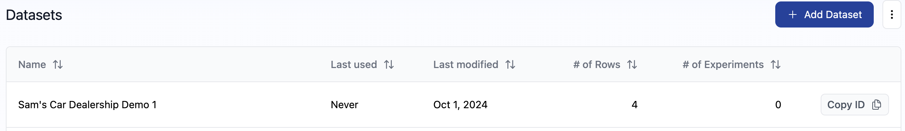
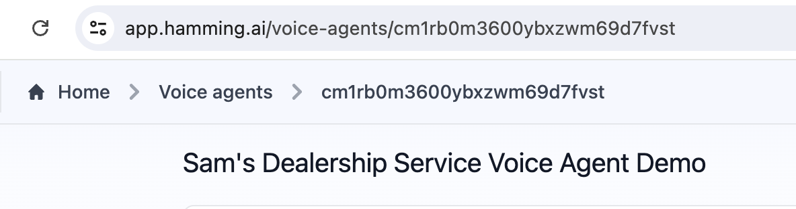

### Set up Voice Monitoring

Voice Monitoring enables you to assess the reliability of your AI voice agent. By following a few simple steps, you can set up monitoring on Hamming.AI to track your agent's performance. Monitoring provides Hume scoring, offering valuable insights into the effectiveness of your voice agent.

<Warning>

**Important**: We currently only support monitoring for Retell AI Agents.

</Warning>

### Components Needed Before Setup

<CardGroup>
  
  <Card 
  title="ngrok Account Setup" 
  icon="square-1">
Before getting started, ensure that you have installed ngrok and set up an account by visiting [ngrok.com/download](www.ngrok.com/download).
  </Card>

  <Card 
  title="Retell AI Agent" 
  icon="square-2">
To monitor your virtual voice agent, ensure that your Retell AI Voice Agent is correctly configured and ready to receive inbound calls.
  </Card>

  <Card 
  title="Hamming API Key" 
  icon="square-3">
  To run the script, you'll also need a Hamming API Key. To set up your Hamming API Key, navigate to [hamming.ai/settings](https://app.hamming.ai/settings) and **create a new secret key** at the top.
  </Card>

</CardGroup>


### Before You Get Started

In order to set up and run a Hamming voice agent programmatically, you need to have your **Dataset ID** and **Agent ID** ready.


<Accordion icon="message-bot" title="Finding Your Dataset ID">

To locate your dataset ID, visit [hamming.ai/datasets](https://app.hamming.ai/datasets?page=1)
On the right side of the dataset, select "Copy ID" to retrieve your dataset ID.



</Accordion>


<Accordion icon="message-bot" title="Finding Your Agent ID">

To find your Agent ID, go to [hamming.ai/voice-agents](https://app.hamming.ai/voice-agents)
and select the name of the voice agent. Your Agent ID is located in the URL immediately following "voice-agents/".



For example, **cm1rb0m3600ybxzwm69d7fvst** represents the Agent ID.


</Accordion>

### Step-by-Step Tutorial

<Steps>

<Step title= "1. Install and Authenticate ngrok">

If you haven't already, visit https://ngrok.com/download to install ngrok and generate your authtoken. Then, run the following command, replacing YOUR_AUTHTOKEN with the token you created.

```
ngrok config add-authtoken YOUR_AUTHTOKEN

```

  </Step>

 <Step title="2. Run ngrok" >

To run ngrok, run the following command:

  ```
ngrok http 3010

```
 
  </Step>

<Step title="3. Set up Retell AI Webhook">

Once you complete step 2, a window should appear with a forwarding link. Copy the link and add **/retell-webhook** at the end of the link. Your final link should look something like this: 

```
https://688ee840-00505-39395.ngrok-free.app/retell-webhook

```

Head to https://dashboard.retellai.com/agents and select your agent. You should see a tab called "Webhook Settings". Now, paste the link you created into 'Agent Level Webhook URL' field.

  </Step>


</Steps>


