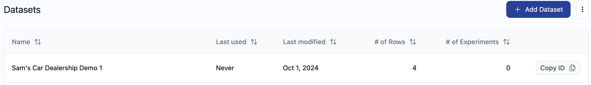
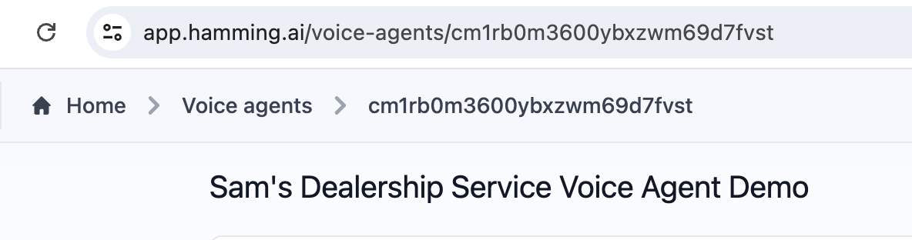

### Run a Hamming Test Agent Programmatically


<Warning>

**Important**: Before running your Hamming test agent using the API, ensure your test agent is properly set up. For a detailed, step-by-step guide on creating a dataset and configuring the prompt, scorer, and voice agent, refer to [this template](https://docs.hamming.ai/guides/voice-agent).

</Warning>

### Things You Need to Succeed

In order to set up and run a Hamming voice agent programmatically, you need to have your **Dataset ID** and **Agent ID** ready.


<Accordion icon="message-bot" title="Finding your Dataset ID">

To locate your dataset ID, visit [hamming.ai/datasets](https://app.hamming.ai/datasets?page=1)
On the right side of the dataset, select "Copy ID" to retrieve your dataset ID.



</Accordion>


<Accordion icon="message-bot" title="Finding your Agent ID">

To find your Agent ID, go to [hamming.ai/voice-agents](https://app.hamming.ai/voice-agents)
and select the name of the voice agent. Your Agent ID is located in the URL immediately following "voice-agents/".





</Accordion>


<Steps>

<Step title= "1. Start Agent Test Run">

This will start a set of calls in parallel - we call it a Voice Experiment.
```
POST https://app.hamming.ai/api/rest/voice-experiment/{agent_id}

Request Body:
{ "to_number": "+12063991234", "dataset_id": "{dataset_id}"}

Response:
{ "voice_experiment_id" }

```


  </Step>

 <Step title="2. Get Voice Experiment" >

You can use this endpoint to poll for the Voice Experiment status.

  ```
GET https://app.hamming.ai/api/rest/voice-experiment/{voice_experiment_id}

Response:
{ "id": "voice_experiment_id", "status": "FINISHED" }

```
 
  </Step>

<Step title="3. Get Voice Experiment Calls">

Once the experiment is FINISHED, you can query the score results for the experiment.

```
GET https://app.hamming.ai/api/rest/voice-experiment/{voice_experiment_id}/calls

Response:
{
    "calls": [
       // Array of calls that were run as part of the voice experiment
       // Each call object will include the scoring status.
    ]
}
```

  </Step>


</Steps>


